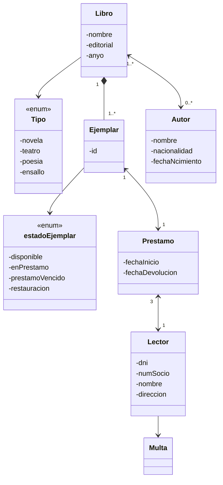

```mermaid
classDiagram

class Libro{
    -nombre
    -editorial 
    -anyo
}
class Tipo{
    -novela 
    -teatro
    -poesia
    -ensallo
}
<<enum>> Tipo
class Ejemplar{
    -id
}
class estadoEjemplar{
    -disponible
    -enPrestamo
    -prestamoVencido
    -restauracion
}
<<enum>> estadoEjemplar
class Autor{
    -nombre 
    -nacionalidad
    -fechaNcimiento
}
class Lector{
    -dni
    -numSocio
    -nombre
    -direccion
}
class Prestamo{
    -fechaInicio
    -fechaDevolucion
}

Libro "1" *-- "1..*"Ejemplar
Ejemplar "1" <--> "1" Prestamo 
Prestamo "3" <--> "1" Lector
Libro "1..*" <--> "0..*" Autor
Libro --> Tipo
Ejemplar --> estadoEjemplar
Lector --> Multa


```